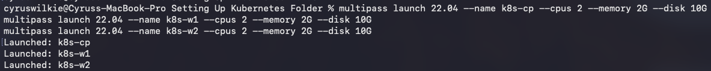
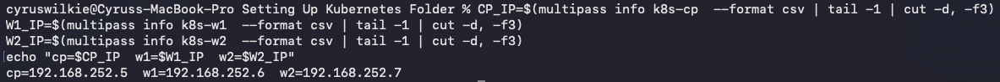
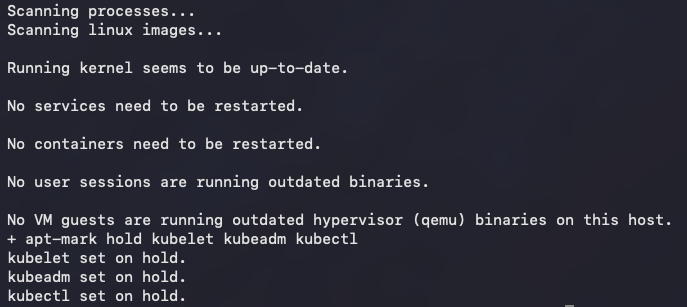
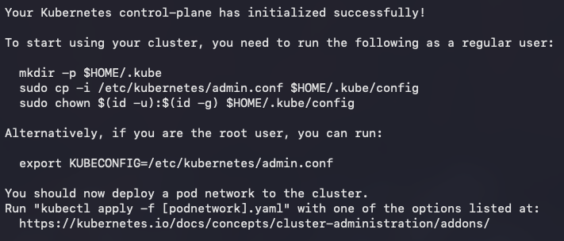
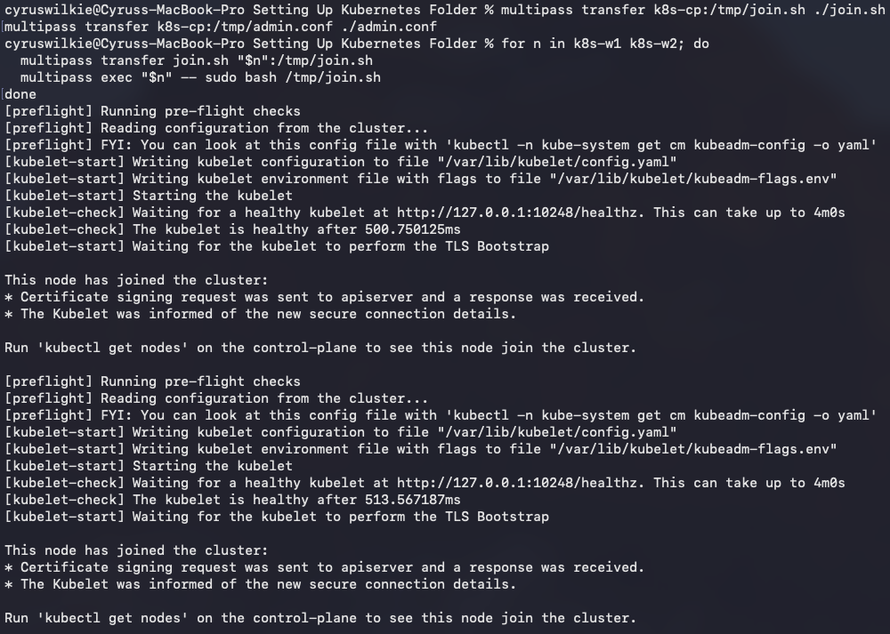
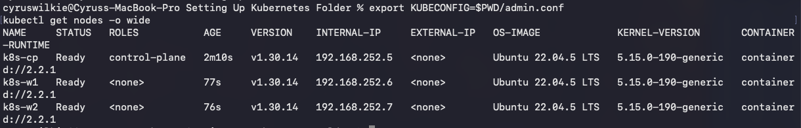
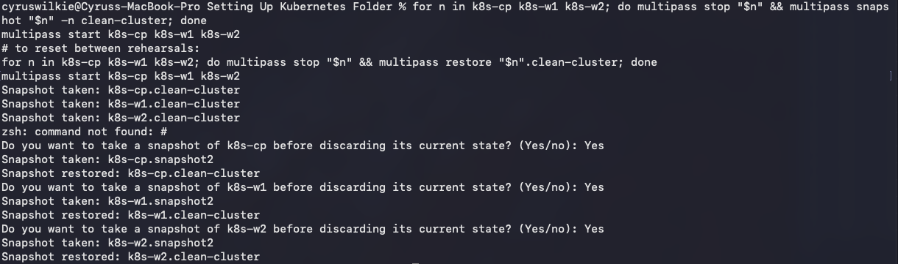
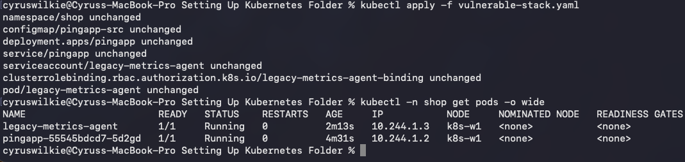
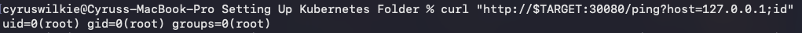

# Setting the Scene

As part of my day job I was recently tasked with performing a penetration test on a Kubernetes cluster. The scenario was simple: emulate an attacker who has somehow gained RCE over an internet-facing application in order to compromise the pod. From that pod, see if there's any way to achieve further compromise of the node, the cluster and beyond.

At least the scenario would have been simple, if not for the following rather pressing gaps in my knowledge:

- I had no idea what a pod is.
- I had no idea what a node is.
- I had no idea what a cluster is.
- I had only the faintest of ideas as to what Kubernetes is (something to do with containers? Managed by people who seem very stressed?).

From this starting point, my first order of business was to go ahead and figure out what I was actually dealing with.

# So What on Earth Is Kubernetes?

In order to educate myself I turned to the multitude of videos available on YouTube explaining the subject. In particular I stumbled upon the videos of Jay Beale who has done a large amount of work on attacking and defending Kubernetes configurations. I watched the talk linked below as it was relatively short and also quite recent. He's done a number of other talks over the years which go into greater depth, including one at DEF CON which I would highly recommend checking out.

- [Jay Beale — attacking and defending Kubernetes (YouTube)](https://www.youtube.com/watch?v=J48dspHl6Iw)

I'm not going to attempt to cover the full breadth of what Kubernetes is and the techniques available for attacking it as I would never be able to do that topic justice. However, from this research my broad learnings were as follows:

- The smallest organisational unit of a Kubernetes cluster is a pod. Contrary to what I previously thought, pods are not the same as containers; rather, they can contain multiple containers networked together. This confused me at first but I later realised that differentiating pods and containers is useful as many applications rely on more than just the one container.
- Pods are hosted on nodes. Nodes are essentially the actual computing hardware that Kubernetes runs on; each one represents an actual host within the cluster. In an AWS-hosted EKS cluster a node will usually be an EC2 instance running Kubernetes workloads.
- Pods and nodes make up the actual Kubernetes cluster. The cluster is the largest organisational unit. Clusters have a control plane, which is essentially a node that manages the cluster and schedules workloads across the other nodes within it.

Also of note are namespaces, which can be used to organise clusters, as well as various other nuanced concepts; however, I won't delve too deeply into these here.

# So What Does This Look Like in Practice?

Being armed with this new found knowledge was nice, but looking at the production grade Kubernetes cluster I had been tasked with testing, I still felt a bit daunted. What do I actually need to do to access the pods? What kind of roles do I need? What kind of tooling would I need to use? What configurations would I need to be aware of?

And more to the point, what does a vulnerable cluster look like? What are the configurational issues I need to look for? How would I actually identify them?

To answer all these questions and help me feel a little more confident that I was ready to test, I decided to go ahead and construct my own (purposely vulnerable) cluster on an Apple Silicon MacBook Pro which I had available for the task.

As I am a child of the Z generation, and thus chronically averse to doing any thinking of my own, I decided to turn to Claude to instruct me on how to achieve this and I found it was able to do a pretty good job. Below I outline the steps I took to get my setup running in the hopes that it may provide something of a guide to anyone else who might wish to attempt this.

## 1. Getting the Prerequisites Ready

Probably the most nuanced part of this setup was the need to find virtualisation software that works with Apple Silicon's ARM architecture. Some guides recommended using Docker containers in place of virtual machines, but I wanted the most authentic experience possible. For this task I discovered [Multipass](https://multipass.run/) which makes use of Apple's built-in virtualisation framework and doesn't need any kernel extensions or third-party hypervisor drivers.

```bash
brew install --cask multipass
multipass version
```

## 2. Preparing the Provisioning Scripts

Next I got Claude to write me a couple of scripts to run on my virtual machines in order to set them up with the necessary tooling and configurations to become part of a Kubernetes cluster. I started with the common script which was to be run across all of the nodes.

### `provision-common.sh` (runs on all 3 nodes)

```bash
#!/usr/bin/env bash
set -euxo pipefail

swapoff -a
sed -i '/ swap / s/^/#/' /etc/fstab

cat <<EOF | tee /etc/modules-load.d/k8s.conf
overlay
br_netfilter
EOF
modprobe overlay
modprobe br_netfilter

cat <<EOF | tee /etc/sysctl.d/k8s.conf
net.bridge.bridge-nf-call-iptables  = 1
net.bridge.bridge-nf-call-ip6tables = 1
net.ipv4.ip_forward                 = 1
EOF
sysctl --system

apt-get update
apt-get install -y containerd apt-transport-https ca-certificates curl gpg

mkdir -p /etc/containerd
containerd config default | tee /etc/containerd/config.toml
sed -i 's/SystemdCgroup = false/SystemdCgroup = true/' /etc/containerd/config.toml
systemctl restart containerd

mkdir -p -m 755 /etc/apt/keyrings
curl -fsSL https://pkgs.k8s.io/core:/stable:/v1.30/deb/Release.key \
  | gpg --dearmor -o /etc/apt/keyrings/kubernetes-apt-keyring.gpg
echo 'deb [signed-by=/etc/apt/keyrings/kubernetes-apt-keyring.gpg] https://pkgs.k8s.io/core:/stable:/v1.30/deb/ /' \
  | tee /etc/apt/sources.list.d/kubernetes.list
apt-get update
apt-get install -y kubelet kubeadm kubectl
apt-mark hold kubelet kubeadm kubectl
```

Then Claude wrote a script specifically for the control plane node.

### `provision-cp.sh` (takes the control-plane's own IP as `$1`)

```bash
#!/usr/bin/env bash
set -euxo pipefail
CP_IP=$1

kubeadm init \
  --apiserver-advertise-address="$CP_IP" \
  --pod-network-cidr=10.244.0.0/16

export KUBECONFIG=/etc/kubernetes/admin.conf
kubectl apply -f https://raw.githubusercontent.com/flannel-io/flannel/master/Documentation/kube-flannel.yml

kubeadm token create --print-join-command > /tmp/join.sh
chmod +x /tmp/join.sh
cp /etc/kubernetes/admin.conf /tmp/admin.conf
chmod 644 /tmp/admin.conf /tmp/join.sh
```

With these in place, my next step was to spin up the VMs and get them ready to start hosting my testing cluster.

## 3. Setting Up the VMs

First I launched the three VMs using arm64 Ubuntu images.
```bash
multipass launch 22.04 --name k8s-cp --cpus 2 --memory 2G --disk 10G
multipass launch 22.04 --name k8s-w1 --cpus 2 --memory 2G --disk 10G
multipass launch 22.04 --name k8s-w2 --cpus 2 --memory 2G --disk 10G
```



Once they'd launched, I made sure to note down their IP addresses for later.

```bash
CP_IP=$(multipass info k8s-cp  --format csv | tail -1 | cut -d, -f3)
W1_IP=$(multipass info k8s-w1  --format csv | tail -1 | cut -d, -f3)
W2_IP=$(multipass info k8s-w2  --format csv | tail -1 | cut -d, -f3)
echo "cp=$CP_IP  w1=$W1_IP  w2=$W2_IP"
```



From there I ran the common provisioning script on all three by first transferring the script to each machine's /tmp folder and then executing it.

```bash
for n in k8s-cp k8s-w1 k8s-w2; do
  multipass transfer provision-common.sh "$n":/tmp/provision-common.sh
  multipass exec "$n" -- sudo bash /tmp/provision-common.sh
done
```



The control plane itself then needed to be set up with its own provisioning script.

```bash
multipass transfer provision-cp.sh k8s-cp:/tmp/provision-cp.sh
multipass exec k8s-cp -- sudo bash /tmp/provision-cp.sh "$CP_IP"
```



Once the control plane was set up I could then pull the join script and admin kubeconfig. The join script is what we'll run on the worker nodes to join them to the cluster just set up by the control plane. The admin kubeconfig will be used to authenticate with the cluster and use Kubernetes' command-line administration tool, `kubectl`.

```bash
multipass transfer k8s-cp:/tmp/join.sh ./join.sh
multipass transfer k8s-cp:/tmp/admin.conf ./admin.conf
```

The join script was then transferred to and run on each of the workers.

```bash
for n in k8s-w1 k8s-w2; do
  multipass transfer join.sh "$n":/tmp/join.sh
  multipass exec "$n" -- sudo bash /tmp/join.sh
done
```



And to polish it all off, I used `kubectl` to validate that my cluster was up and running.

```bash
export KUBECONFIG=$PWD/admin.conf
kubectl get nodes -o wide
```



As a precautionary measure I also made sure to snapshot the configuration using Multipass, so I could easily revert to the newly configured cluster state.

```bash
for n in k8s-cp k8s-w1 k8s-w2; do multipass stop "$n" && multipass snapshot "$n" -n clean-cluster; done
multipass start k8s-cp k8s-w1 k8s-w2
# to reset between rehearsals:
for n in k8s-cp k8s-w1 k8s-w2; do multipass stop "$n" && multipass restore "$n".clean-cluster; done
multipass start k8s-cp k8s-w1 k8s-w2
```



## 4. Deploying the Vulnerable App

With Kubernetes up and running, I now needed to deploy the app itself. The app was fairly simple: it consisted solely of a Flask server which exposed an endpoint containing an RCE. Getting it actually deployed in the cluster required writing up a configuration file which detailed the app's code, the container images required for it to run as well as any further tooling to be installed on the containers.

### `vulnerable-stack.yaml`

```yaml
apiVersion: v1
kind: Namespace
metadata:
  name: shop
---
# --- the vulnerable web app: a 5-line Flask command-injection endpoint ---
apiVersion: v1
kind: ConfigMap
metadata:
  name: pingapp-src
  namespace: shop
data:
  app.py: |
    import os
    from flask import Flask, request
    app = Flask(__name__)

    @app.route("/ping")
    def ping():
        host = request.args.get("host", "127.0.0.1")
        return os.popen(f"ping -c 1 {host}").read()   # <-- unsanitized, classic RCE

    app.run(host="0.0.0.0", port=8080)
---
apiVersion: apps/v1
kind: Deployment
metadata:
  name: pingapp
  namespace: shop
spec:
  replicas: 1
  selector:
    matchLabels: { app: pingapp }
  template:
    metadata:
      labels: { app: pingapp }
    spec:
      nodeSelector:
        kubernetes.io/hostname: k8s-w1     # pin it next to the decoy token below
      containers:
        - name: pingapp
          image: python:3.11-slim
          command: ["sh", "-c", "pip install flask -q && python /app/app.py"]
          volumeMounts:
            - name: src
              mountPath: /app
            - name: hostroot          # <-- the misconfiguration: whole node fs mounted in
              mountPath: /host
          securityContext:
            privileged: true          # <-- the other misconfiguration
      volumes:
        - name: src
          configMap: { name: pingapp-src }
        - name: hostroot
          hostPath: { path: / }
---
apiVersion: v1
kind: Service
metadata:
  name: pingapp
  namespace: shop
spec:
  type: NodePort
  selector: { app: pingapp }
  ports:
    - port: 8080
      nodePort: 30080
---
# --- the decoy: an old "monitoring agent" nobody scoped down, cluster-admin token ---
apiVersion: v1
kind: ServiceAccount
metadata:
  name: legacy-metrics-agent
  namespace: shop
---
apiVersion: rbac.authorization.k8s.io/v1
kind: ClusterRoleBinding
metadata:
  name: legacy-metrics-agent-binding
subjects:
  - kind: ServiceAccount
    name: legacy-metrics-agent
    namespace: shop
roleRef:
  kind: ClusterRole
  name: cluster-admin        # <-- the real root cause of stage 3→4
  apiGroup: rbac.authorization.k8s.io
---
apiVersion: apps/v1
kind: Pod
metadata:
  name: legacy-metrics-agent
  namespace: shop
spec:
  serviceAccountName: legacy-metrics-agent
  nodeSelector:
    kubernetes.io/hostname: k8s-w1     # same node as pingapp — that's the point
  containers:
    - name: agent
      image: busybox
      command: ["sleep", "infinity"]
```

I then used `kubectl` to apply this app and accompanying vulnerable configuration to the cluster.

```bash
kubectl apply -f vulnerable-stack.yaml
kubectl -n shop get pods -o wide     # confirm both pods landed on k8s-w1
```



## 5. Compromising the Pod

To prove this was working as expected and that I could get access to one of the running pods, I popped the RCE in the deployed application.



With this all in place, I was ready to get to work applying my newly learned techniques to compromise a whole cluster.